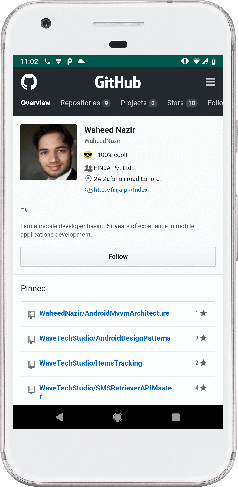
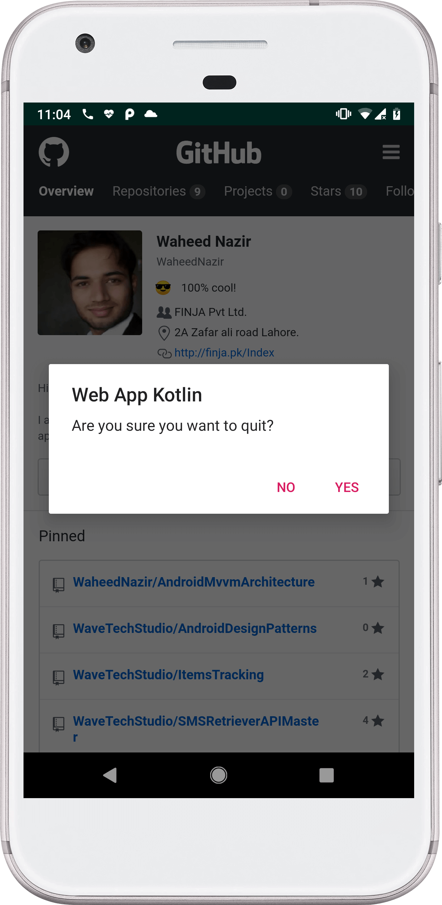

# WebViewAppKotlin
Simple WebView app with Internet connectivity practices developed using Kotlin.
Having features.

```
  - Kotlin
  - Webview / WebClient / WebChromeClient / JavascriptInterface (Handler to communicate with webview)
  - Network Change / BroadcastReceiver  (android.net.conn.CONNECTIVITY_CHANGE)
  - AlertDialog.Builder
```
## How to run a sample
- Clone or download the project open it with Android Studio compile and run it will work.


### Images
 
<br/>


## Author
[Waheed Nazir](https://www.linkedin.com/in/waheed-nazir-36521579/ "Waheed Nazir (WaveTechStudio)")

## License
It is totally free to use. :)

